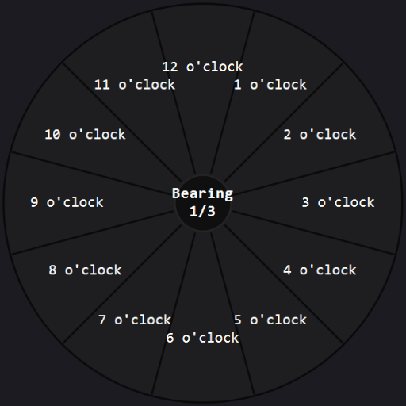
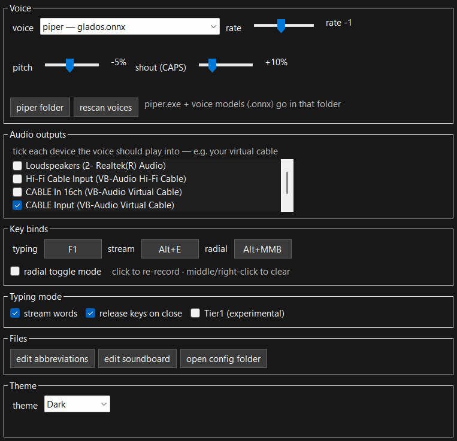

# ShubbleComms

Talk in voice chat without a microphone. ShubbleComms captures what you type, speaks it through a TTS voice, and plays the audio into a virtual microphone (such as ). Everything runs locally.

## Read this first

**WARNING: EVERY LINE OF CODE IN THIS PROJECT IS AI SLOP.** Not one line was written by a competent human. My entire contribution was telling the AI what to make & testing it. There has been no human code review (other than my brief skimming) & no testing beyond me using it on my PC.

What this means for you:

- **Expect jank.** Things will break in ways I haven't found yet. If it crashes, a `crash.txt` appears next to the exe with the error and the last 200 log lines. Attach this to an issue and I might fix it (cough have it fixed).
- **A global keyboard hook written by an LLM is exactly as trustworthy as that sounds.** This project is open source, it's commented, and the project doesn't reference `System.Net` at all. You can audit the whole thing if you want, it's probably safe enough to run (I made this for personal use and thought others could use it, more explained below).

## Why this exists

I wanted an app that let me communicate with my friends effectively while playing games. For some reason, there are very few accessibility tools that allow typing into a text to speech box at the push of a button. With the advent of LLMs, I decided to slop up an app myself, and this is the result.

## Is this for you?

**It is, if:**
- you don't own or don't want a microphone, but want to talk in voice chat
- you can't speak (or can't speak comfortably) but can type
- you want a quick-comms soundboard in games: callouts, presets, sound files
- you want to emulate speaking in a minimally intrusive way

**It is not, if:**
- you expect it to sound like a real microphone. It's TTS, and it sounds like TTS (piper's neural voices are decent, SAPI sounds like 2003)
- you need macOS/Linux — Windows only, x64 only
- you want supported, polished software — see the slop warning above

## What it does

### Talk without a mic

Press **F1** anywhere — a game, a browser, anything. Your keystrokes stop going to the app and go into a text overlay instead. Press **Enter** and the message is spoken through your chosen voice. Press **F1** again and the keyboard is back to normal. The game never sees a single keystroke you typed. **Critically, if you hold W to move forward and then press F1, your character in-game will continue walking as you type.**


The overlay is a real text editor: cursor, selection, Ctrl+A/C/X/V, word jumps with Ctrl+arrows. `Esc` clears the message.

### Stream or full messages

Two modes, toggled with **Alt+E**:

- **Stream mode** — every word is spoken the moment you hit space. React at conversation speed, at the cost of consistent vocal clarity.
- **Full mode** — nothing is spoken until Enter. Edit, backspace, reconsider, then send the whole thing.

### Shouting

Type a word in ALL CAPS and it comes out louder and higher. Works per-word: `you are SUCH an IDIOT` shouts exactly `SUCH` and `IDIOT`. A whole message in caps shouts as one piece. The strength is a slider; at zero, caps just read as normal text.

### The radial soundboard



Hold **alt + mmb** and steer. A weapon-wheel appears with up to 12 slots; release over one to play it. The scroll wheel switches presets, and while it's open the program attempts to counteract cursor movement in your application to minimize camera movement.

Slots can be spoken phrases or sound files: put a line like `@airhorn.wav` in `soundboard.txt` and it plays through the same virtual mic as your voice. Everything pre-renders on load, so playback is instant (probably redundant as it's pretty fast, but better safe than sorry).

### Plenty of choice for voice

Two engines:

- **SAPI** — Default Microsoft voices. Works out of the box; install more from language settings in Windows.
- **Piper** — offline neural TTS. Runs 100% locally: no account, no download-at-runtime, no network. The release zip ships piper with a GLaDOS voice (the fan-made [dnhkng/GLaDOS](https://github.com/dnhkng/GLaDOS) model); extra voices are drag-and-drop into the voices folder. Building from source? [Add piper yourself](#building-from-source) — any piper voice works.

Both engines get the same rate, pitch, and shout sliders, and both support per-voice expansion dictionaries — `brb -> be right back` for everyone, `glados -> gladdaus` for the one voice that says it wrong.

### Everything else



- Multiple simultaneous outputs — tick several sound outputs and the voice goes to all of them
- Every bind re-recordable: click the bind button, press a new key or mouse button
- Themes (Dark, Matrix, Portal, Ice) — plain JSON files in %APPDATA%\ShubbleComms\themes\: edit them, add your own, or drop a white-on-transparent PNG as a custom mode indicator
- Starts minimized to the tray; double-click the tray icon for settings


## Getting started

1. Install [VB-CABLE](https://vb-audio.com/Cable/) (free) and reboot.
2. Run ShubbleComms — it lives in the system tray. Double-click the tray icon.
3. Under **Audio outputs**, tick **CABLE Input** (and your headphones/speakers if you want to hear yourself).
4. In Discord: Settings → Voice & Video → Input Device → **CABLE Output**.
5. Press **F1** in any app, type something, press **Enter**. You're talking.

The release zip already contains piper and the GLaDOS voice — pick `piper — glados` in the voice dropdown and go. Depending on which zip you grabbed you may need the [.NET 10 Desktop Runtime](https://dotnet.microsoft.com/download); the self-contained one has it baked in.

## Troubleshooting

- **No sound at all** — an output must be ticked in settings, and Discord's input must be the matching capture end. If you have more than one cable installed, it's trial and error: tick one output in ShubbleComms, set Discord to that cable's Output, test, repeat. (Also make sure only Cable Input is checked, not Cable In 16ch & Cable Input. Cable Input refuses any input of Cable In 16ch is also receiving data.)
- **Nothing happens when I press F1, or F1 opens the game's help page** — if the game runs as administrator, the keyboard hook can't see input unless ShubbleComms also runs as administrator. Run both at the same elevation, or neither.
- **Some games ignore the binds entirely** — certain anti-cheats block low-level hooks. Nothing this app can do about that.
- **First piper phrase is slow** — normal; the model loads once per voice selection. After that, each new phrase takes ~100–300 ms and repeated phrases come from cache instantly.
- **Sounds never overlap** — deliberate. Playback queues: sounds and speech line up in order.
- **It crashed** — `crash.txt` appears next to the exe with the exception and the last 200 log lines. Attach it to an issue.

## Building from source

Requires the .NET 10 SDK, Windows, x64:

```
dotnet build
```

To use piper voices with a source build:

1. Download piper's Windows release from [github.com/rhasspy/piper/releases](https://github.com/rhasspy/piper/releases) and extract it into a `piper\` folder next to the exe.
In ShubbleComms settings, click voices folder — it opens `piper\voices`.
3. Drop in voice models: each is a `.onnx` file plus its matching `.onnx.json`. Official voices: [huggingface.co/rhasspy/piper-voices](https://huggingface.co/rhasspy/piper-voices). The GLaDOS voice: [github.com/dnhkng/GLaDOS](https://github.com/dnhkng/GLaDOS), also mirrored on [Hugging Face](https://huggingface.co/rokeya71/VITS-Piper-GlaDOS-en-onnx).
4. Click **rescan voices**, then pick the `piper —` entry in the dropdown.

## The technical bits (this entire part is written by the LLM I do not know what I am doing)

**How it works:** a pair of low-level Windows hooks (keyboard + mouse) on a dedicated thread capture input in typing mode and swallow it; text goes to the active TTS engine, rendered to mono PCM at the cable's negotiated rate, and written into every ticked output through WASAPI. The radial overlay is a per-pixel-alpha layered window pushed via `UpdateLayeredWindow`, with camera-lock implemented by counter-injecting mouse movement while the wheel is open. Keys held when typing mode opens stay logically down for the game ("pinned") and are cleanly released on close.

**Files:**

- Settings, expansions, soundboard, message history: %APPDATA%\ShubbleComms
- Themes: %APPDATA%\ShubbleComms\themes\ — JSON, one file per theme, "indicator" can name a PNG
- Piper: `piper` next to the exe; voice models in piper\voices\ (the voices button in settings opens it)
- `soundboard.txt` syntax:
  - `[Name]` starts a preset, one entry per line
  - plain line = spoken phrase (expansions apply)
  - `@airhorn.wav` = sound file, relative to the file itself (or absolute, or `~\Music\ding.wav`); `.wav .mp3 .m4a .aac .wma .aif`
  - live-reloads on save; 8 or fewer slots per preset reads best, 12 = clock face
- `expansions.txt` syntax:
  - `abbr -> expansion` — every voice
  - `abbr -> expansion #en` — any English voice; `#en-GB` — British only
  - `abbr -> expansion @glados` — only voices whose name contains "glados"
  - expansions apply to speech only; the display shows what you typed; live-reloads on save

**Privacy, concretely:** the app makes no network calls — the project doesn't reference `System.Net`, and you can verify that in ten seconds. The only way audio leaves your machine is through the virtual cable you installed and whatever the app on the other end (Discord, etc.) does with it. Piper runs as a local subprocess. No telemetry, no analytics, no crash reporting — crashes land in a local file that *you* choose to attach.

## License

ShubbleComms is MIT — see [LICENSE](LICENSE).

It depends on and bundles third-party components with their own licenses — see [THIRD-PARTY-NOTICES](THIRD-PARTY-NOTICES): NAudio (MIT), piper (MIT; its builds include espeak-ng under GPLv3), and the GLaDOS voice model by dnhkng (MIT, trained on Portal voice lines — © Valve Corporation, included non-commercially as fan content).